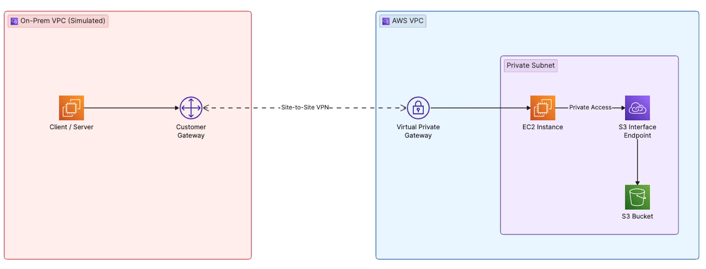

# Private S3 Access from On-Premises Through AWS Using an Interface VPC Endpoint

## Introduction

Most tutorials show you how to reach S3 privately from a VPC using a Gateway endpoint. That works fine — until the traffic originates *outside* AWS. A Gateway endpoint is a route-table entry; it cannot be reached from on-premises networks over VPN or Direct Connect. The moment your workload lives in a data center or a colo, the story changes.

This post walks through a demo of that exact scenario. We simulate an on-premises data center in one AWS account, connect it to a second AWS account over a Site-to-Site VPN, and access an S3 bucket from the "on-prem" side through an **Interface VPC Endpoint** (powered by AWS PrivateLink). No public internet, no NAT gateway, no S3 traffic leaving the AWS private network. Everything is provisioned via Terraform so you can spin it up, poke at it, and tear it down.

The goal is to make the trade-off between Gateway and Interface endpoints concrete and to leave you with a working reference you can rebuild in about an hour.

## Infrastructure Requirements

**You need two isolated networks to test this.** The whole point is proving that S3 traffic can originate *outside* the VPC that owns the endpoint, so you need two separate environments joined by a VPN. There are two ways to get them:

- **Two AWS accounts (recommended, what this repo uses).** A **Workload Account** (S3 + Interface Endpoint + VGW) and an **On-Prem Account** (simulates the data center). This most faithfully mirrors a real hybrid setup and keeps the "on-prem" side genuinely separate.
- **One AWS account with two VPCs.** A workload VPC and a second VPC that plays the "on-prem" role, connected by the same Site-to-Site VPN. This works and is cheaper to manage, but you lose the cross-account IAM realism (no bucket-policy-plus-identity-policy dance — a single identity policy suffices).

Either way the architecture is identical; only the provider/account wiring differs. This repo ships the two-account variant using Terraform provider aliases; collapsing it to one account is a matter of pointing both aliases at the same profile and dropping the cross-account bucket policy.

**Why not the AWS Builder Center sandbox?** The sandbox accounts are convenient, but they impose service and permission restrictions that block this specific demo — you can't create Virtual Private Gateways, Site-to-Site VPN connections, or Customer Gateways in most sandbox environments. For the two-account variant you need **two AWS accounts you own** (personal, org-linked sub-accounts, or two accounts in an AWS Organizations sandbox OU).

You'll need:

- Two AWS accounts (or one account + two VPCs) in the same region. This repo was validated in `ap-southeast-1`; any region works — just keep both sides in the same one. We'll call them **Workload Account** (holds S3 + Interface Endpoint + VGW) and **On-Prem Account** (simulates the data center).
- Named AWS CLI profiles for each account (`~/.aws/credentials` or SSO).
- An EC2 key pair in the on-prem account for SSH.
- Terraform ≥ 1.5 and `awscli` v2 locally.

**Cost.** Expect roughly **$1–3/day** while running. The Site-to-Site VPN is $0.05/hour, the Interface Endpoint is ~$0.01/hour per AZ, plus a small amount of data processing. Destroy when you're done.

## Architecture



Traffic path: `client → strongSwan → IPsec tunnel → VGW → private subnet → Interface Endpoint ENI → S3 over PrivateLink`. The S3 hostname resolves to a private IP inside the workload VPC, and the packet never touches a public endpoint.

## Technical Setup

The full Terraform lives in [`terraform/`](./terraform/) — it's a single project with two provider aliases (`aws.aws` for the workload account, `aws.onprem` for the on-prem simulation). What follows is what each section does and what you'll still need to do manually after `terraform apply`.

### Prep

```bash
cd terraform
cp terraform.tfvars.example terraform.tfvars
# edit: set both profiles, key_pair_name, my_ip_cidr, bucket_name
terraform init
```

### Phase 1 — On-Prem Side (`onprem.tf`)

Terraform provisions:

- VPC `10.100.0.0/16` with an internet gateway and a public subnet (`10.100.1.0/24`).
- An **Elastic IP** — this becomes the "on-prem public IP" used as the Customer Gateway address on the AWS side.
- A **VPN endpoint EC2** (Amazon Linux 2023, `t3.micro`) with `source_dest_check = false` and IP forwarding enabled via user-data. It runs **libreswan** — note that AL2023 has *no* `strongswan` package in its repos, and EPEL's RHEL9 packages don't resolve against AL2023's `$releasever`. libreswan is in the default repos, speaks the same `ipsec.conf` syntax, and is fully supported by AWS Site-to-Site VPN. The user-data templates the full tunnel config (both `conn` stanzas and both PSKs) from the VPN connection outputs, so the tunnels come up automatically — no manual editing (see phase 3).
- A **client EC2** that will run `aws s3` commands.
- Security groups: strongSwan allows UDP 500/4500 + ESP inbound; both hosts allow SSH from your IP only.
- A static route in the on-prem VPC's route table sending `10.0.0.0/16` traffic to the strongSwan ENI.

### Phase 2 — AWS Workload Side (`aws-workload.tf`)

Terraform provisions:

- VPC `10.0.0.0/16` with a private subnet (`10.0.1.0/24`). **No IGW, no NAT.** The VPC is genuinely private.
- A **Virtual Private Gateway** attached to the VPC, with route propagation enabled on the private subnet's route table.
- An **S3 bucket** (`force_destroy = true` for easy cleanup) with public-access-block on and versioning enabled. A sample `test.txt` object is uploaded. A **bucket policy** grants the on-prem client role read access — cross-account S3 needs *both* this and an identity policy on the role. (One-account variant: the bucket policy is unnecessary; the identity policy alone is enough.)
- An **Interface VPC Endpoint** for `com.amazonaws.us-east-1.s3` with **Private DNS enabled** — this is the piece that makes `s3.us-east-1.amazonaws.com` resolve to a private IP inside the VPC. Its security group allows HTTPS from the on-prem CIDR only.
- A **Customer Gateway** pointing at the strongSwan EIP, and a **Site-to-Site VPN connection** in static-routing mode with `10.100.0.0/16` as the static route.

### Phase 3 — VPN Endpoint Comes Up on Its Own

Terraform templates the libreswan config directly into the EC2 user-data ([`strongswan-userdata.sh.tftpl`](./terraform/strongswan-userdata.sh.tftpl)), interpolating the tunnel addresses and PSKs from the `aws_vpn_connection` resource. On first boot the instance installs libreswan, enables IP forwarding, writes `/etc/ipsec.d/aws.conf` + `/etc/ipsec.d/aws.secrets`, and starts the tunnels. No manual SSH step is required.

**One critical detail: the IKE/ESP proposals.** AL2023's system crypto-policy disables the weak DH group 2 (`modp1024`) that many older AWS VPN examples use, so libreswan refuses to load a `conn` that requests it (`IKE DH algorithm 'modp1024' is not supported`). The config therefore uses **DH group 14 (`modp2048`) with AES-256/SHA-256**, which AWS accepts by default:

```
ike=aes256-sha256-modp2048
phase2alg=aes256-sha256-modp2048
```

If you want to watch the negotiation, SSH to the instance after boot:

```bash
sudo ipsec status                 # loaded 2, active 1 is expected
sudo ipsec trafficstatus          # established tunnel + byte counters
sudo journalctl -u ipsec -f       # live IKE/ESP logs
```

You should see `IKE SA established` followed by `IPsec SA established tunnel mode`. AWS keeps **one** tunnel up and the second on standby for failover, so `active 1` is correct — not a bug.

### Test

SSH into the client EC2 (replace the region in the hostnames with yours):

```bash
# The endpoint's VPCE-specific hostname always resolves to its private IP —
# use it to prove the tunnel + endpoint are reachable, independent of DNS.
dig +short vpce-xxxxxxxx.s3.ap-southeast-1.vpce.amazonaws.com
# Should return 10.0.1.x — the endpoint ENI IP
```

**DNS gotcha (the interesting part).** Querying the *regional* S3 name from the on-prem side returns **public** IPs:

```bash
dig +short s3.ap-southeast-1.amazonaws.com   # returns public 3.5.x / 52.x addresses
```

That's expected. Private DNS for an interface endpoint only applies to queries that hit the **workload VPC's** Route 53 resolver. The on-prem client resolves via its *own* VPC resolver, which knows nothing about the endpoint. The production fix is a **Route 53 Resolver inbound endpoint** in the workload VPC plus a conditional forwarder on the on-prem side for `amazonaws.com`.

For a quick demo you can shortcut with an `/etc/hosts` entry — but note **`dig` does not read `/etc/hosts`**, so verify with `getent` (which uses the same resolver path as the `aws` CLI):

```bash
ENDPOINT=$(dig +short vpce-xxxxxxxx.s3.ap-southeast-1.vpce.amazonaws.com | head -1)
echo "$ENDPOINT s3.ap-southeast-1.amazonaws.com" | sudo tee -a /etc/hosts

getent hosts s3.ap-southeast-1.amazonaws.com   # should now show 10.0.1.x

# List and read the object over the private path (force path-style so the
# request uses the s3.<region> hostname the hosts entry overrides)
aws s3 ls s3://<bucket-name>/ --endpoint-url https://s3.ap-southeast-1.amazonaws.com
aws s3 cp s3://<bucket-name>/test.txt -
```

**IAM gotcha.** Once traffic crosses the tunnel, S3 answers at the *application* layer — so an `AccessDenied` is actually good news (the packets got there). Cross-account access needs **both** an identity policy on the on-prem client role **and** a bucket policy naming that role as principal. Terraform provisions both; miss either and you get `AccessDenied`. (In the one-account variant, the identity policy alone is sufficient.)

## Benefits — Why Interface Endpoints Instead of Gateway

Gateway endpoints are free and simple, but they have a hard limit: **they only work for traffic that originates inside the VPC that owns the route table**. Specifically, a Gateway endpoint cannot be reached from:

- On-premises networks over Site-to-Site VPN or Direct Connect.
- Peered VPCs (the route doesn't propagate across peering).
- VPCs on the other side of a Transit Gateway.

Interface endpoints solve this because they are backed by an ENI with a private IP inside your subnet. Anything that can reach that IP — including on-prem hosts over VPN — can reach the service.

Concrete cases where you need Interface endpoints for S3:

1. **Hybrid workloads.** Backup jobs, data ingest, or analytics running in a data center that need private S3 access without egressing to the internet.
2. **Compliance.** Regulated workloads (PCI, HIPAA, government) that must guarantee data never traverses the public internet. Interface endpoints provide an auditable private path.
3. **Central egress architectures.** A shared services VPC with Interface endpoints, accessed by many spoke VPCs and on-prem sites through a Transit Gateway. One endpoint, many consumers.
4. **DNS consistency.** Applications hard-coded to `s3.us-east-1.amazonaws.com` continue working unchanged — Private DNS transparently redirects them.

The trade-off worth naming: Interface endpoints cost roughly **$0.01/hour per AZ** plus data processing, while Gateway endpoints are free. If your traffic is purely intra-VPC, Gateway is the right answer. If it's hybrid or cross-account, Interface is often the only answer.

## Conclusion

The demo collapses a common enterprise pattern into two accounts, one Terraform project, and about an hour of setup. The important takeaway isn't the strongSwan config — it's the mental model: a Gateway endpoint is a *route*, an Interface endpoint is an *IP*. Routes don't cross VPN or peering boundaries; IPs do.

If you're building a hybrid architecture and your S3 traffic needs to originate from outside a single VPC, Interface endpoints (with Private DNS and, when needed, Route 53 Resolver inbound endpoints for cross-network name resolution) are the pattern to reach for. Everything else — TGW attachments, endpoint policies, VPC Lattice, S3 Multi-Region Access Points — builds on that same primitive.

Clone the repo, `terraform apply`, break something, `terraform destroy`. The diff between "tunnels up" and "DNS returning a `10.x` address" is where most of the real learning lives.
